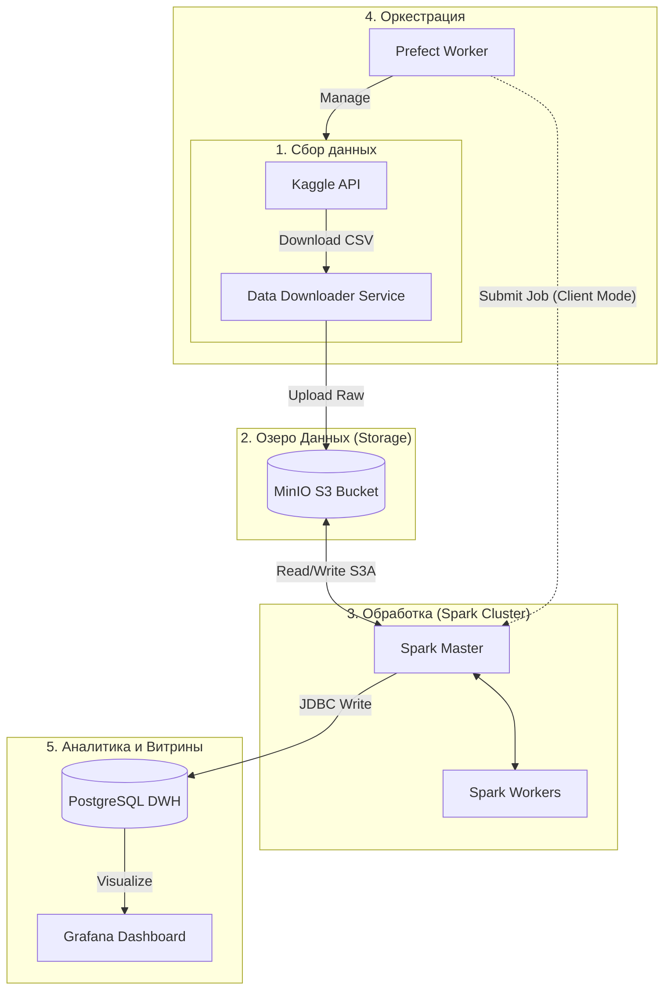

# 🛒 Olist E-Commerce: End-to-End Big Data Pipeline
---

## 📖 О проекте

Данный проект реализует **масштабируемый ETL-пайплайн** для обработки данных бразильского E-Commerce (Olist Dataset). Архитектура построена на принципах **Data Lake**, обеспечивая разделение хранения и вычислений.

Система полностью контейнеризирована и автоматизирует полный цикл работы с данными: от загрузки сырых CSV-файлов до построения аналитических витрин и дашбордов.

---

## 🏗 Архитектура системы

Проект реализован в парадигме **Microservices** с использованием Docker Compose. Потоки данных оркестрируются через Prefect.



### Ключевые архитектурные решения

#### 1. Decoupled Storage & Compute
Вместо хранения данных локально на узлах Spark (HDFS), используется объектное хранилище **MinIO** (S3-compatible).

#### 2. Spark Client Mode Deployment
Контейнер Prefect выступает в роли **Spark Driver**. Он инициализирует `SparkSession` локально, подключаясь к кластеру (`spark://spark-master:7077`) по сети. Это упростило отладку, убирая необходимость проброса сокетов Docker и повысило безопасность.

#### 3. Factory & Strategy Patterns
Обработка различных типов файлов (Orders, Payments, Customers) инкапсулирована в класс `DataProcessor`. Используется фабричный метод для выбора стратегии трансформации в зависимости от имени файла. Это позволяет легко добавлять новые типы данных, не меняя основной пайплайн (принцип Open/Closed из SOLID).

---

## 🛠 Технологический стек

| Область | Технология | Обоснование выбора |
| :--- | :--- | :--- |
| **Orchestration** | **Prefect 2** | Современная альтернатива Airflow. Native Python code, динамическое создание задач, удобный UI и отсутствие переусложненных DAG-файлов. |
| **Compute** | **Apache Spark 3.5** | Стандарт для обработки Big Data. Позволяет параллельно обрабатывать гигабайты данных, используя In-Memory вычисления. |
| **Storage** | **MinIO** | High-Performance Object Storage. Обеспечивает S3-совместимый API, что позволяет в будущем легко мигрировать на AWS S3 без изменения кода. |
| **DWH** | **PostgreSQL** | Надежная реляционная СУБД для хранения агрегированных витрин ("Gold" layer), готовых к потреблению BI-инструментами. |
| **Visualization** | **Grafana** | Мощный инструмент для визуализации метрик и построения бизнес-дашбордов на основе SQL-запросов. |

---

## 🚀 Инструкция по запуску

### Предварительные требования
*   **Docker Desktop** (или Docker Engine + Compose)
*   **Kaggle API Token** (файл `kaggle.json`)

### Шаг 1: Настройка окружения
Создайте файл `.env` в корне проекта (можно скопировать из примера ниже) и поместите `kaggle.json` в папку `.kaggle/`.

```bash
# --- PostgreSQL ---
POSTGRES_USER=user
POSTGRES_PASSWORD=password
POSTGRES_DB=project_db
POSTGRES_HOST=postgres
POSTGRES_PORT=5432

# --- MinIO ---
MINIO_ROOT_USER=minioadmin
MINIO_ROOT_PASSWORD=minioadmin
MINIO_ENDPOINT=minio:9000
MINIO_BUCKET=raw-data

# --- Spark ---
SPARK_MASTER_HOST=spark-master
SPARK_MASTER_PORT=7077
SPARK_MASTER_WEBUI_PORT=8080
SPARK_MASTER_REST_PORT=6066
# URL для отправки задач через REST API
SPARK_MASTER_REST_URL=http://spark-master:6066/v1/submissions/create

# --- Prefect ---
# Внутренний адрес API для воркеров и UI
PREFECT_API_URL=http://prefect-server:4200/api
```

### Шаг 2: Запуск контейнеров
```bash
docker-compose up -d --build
```

### Шаг 3: Доступ к интерфейсам

| Сервис | URL | Описание |
| :--- | :--- | :--- |
| **Prefect UI** | [http://localhost:9090](http://localhost:9090) | Запуск и мониторинг пайплайнов |
| **Spark Master** | [http://localhost:8080](http://localhost:8080) | Состояние кластера и воркеров |
| **MinIO Console** | [http://localhost:9001](http://localhost:9001) | Просмотр сырых файлов (Login: `minioadmin`) |
| **Grafana** | [http://localhost:3000](http://localhost:3000) | Аналитика (Login: `admin` / `admin`) |

---

## 🔧 Возможные проблемы и решения

### 🛑 Windows: Port 7077 already in use / Forbidden
На Windows диапазон портов может быть зарезервирован службой Hyper-V/WinNAT.
**Решение:** Выполните в PowerShell от имени Администратора:
```powershell
net stop winnat
net start winnat
docker-compose restart spark-master
```

### 🛑 Spark: ClassNotFoundException
Если Spark не видит драйверы S3 или Postgres:
1. Убедитесь, что volume `./spark/jars` примонтирован в `/opt/extra-jars`.
2. Проверьте, что в аргументах `spark-submit` передан параметр `--jars` с правильными путями.
---
<div align="center">


</div>